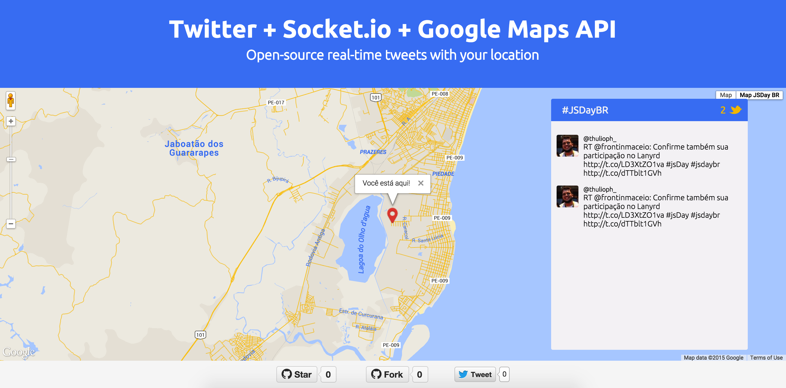

## Twitter Realtime

Twitter API + Socket.io + Google Maps API + Notify = Real-time :zap:



## Como funciona?

A brincadeira está em mostrar no mapa o local de um determinado _tweet_ com a hashtag que está sendo monitorada. Se você quer ver como funciona, basta tuitar qualquer coisa contendo a hashtag **#TwitterRealtime** e na hora que for tuitar compartilhar a sua localização.

> Para seu _tweet_ aparecer no mapa a localização é essencial. 

## Testando local

É necessário que você tenha instalado [Socket.io](http://socket.io/) e [Node.js](https://nodejs.org/en/) para rodar o projeto.

```
git clone git@github.com:thulioph/twitter-realtime.git
```

```
npm install
```

```
node index.js
```

O servidor irá rodar em: `http://localhost:3000/`

## Outras engines

Foi adicionado ao projeto o [Leaflet](http://leafletjs.com/) como engine alternativa para o Google Maps, você pode conferir o exemplo funcionando [nesta branch](https://github.com/thulioph/twitter-realtime/tree/leaflet-js).

## License

[MIT License](http://thulioph.mit-license.org/) © thulioph